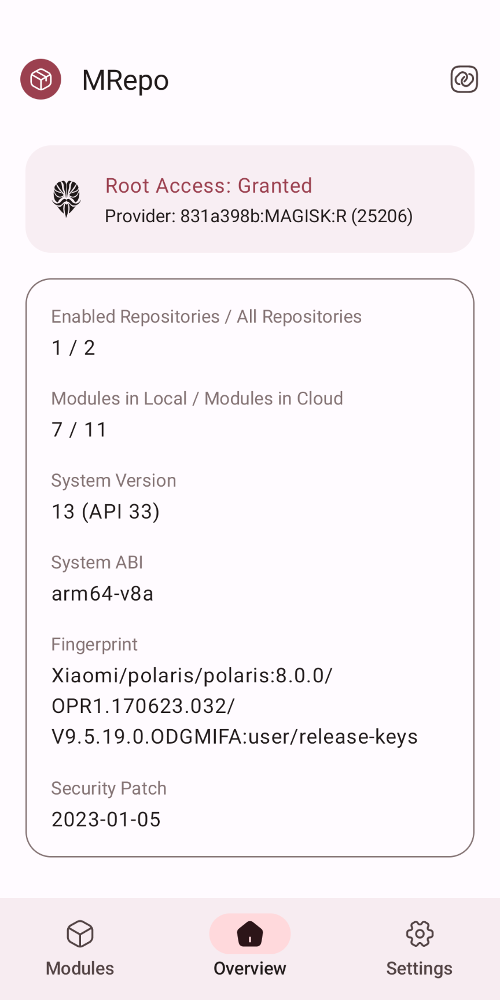
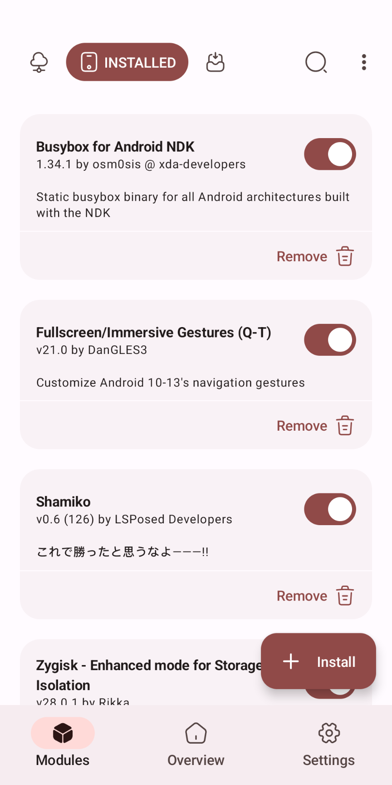
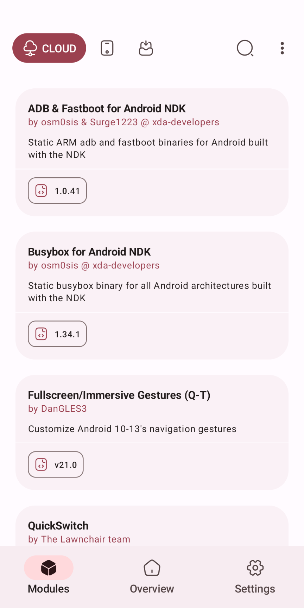
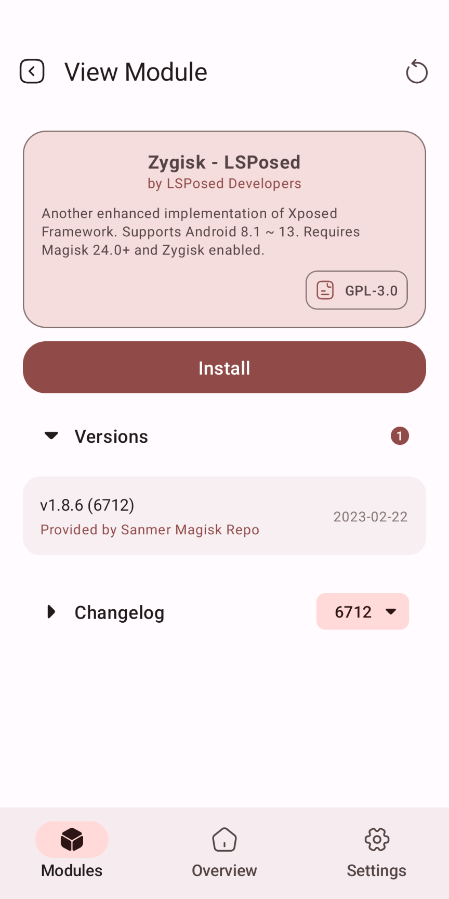
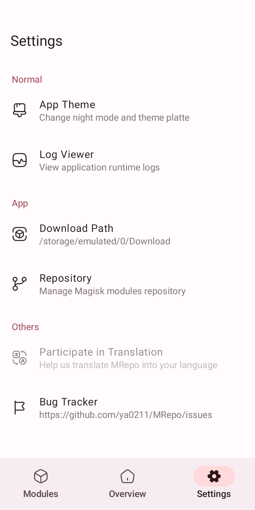

# MRepo
   

MRepo (short for `My Repository` or `Modules Repository`) is an Android app that helps manage your own modules repository.

## Preview

  
  

## Supported Versions
- Android 8.0 ~ 14
- Magisk 24.0 ~ latest
- KernelSU 0.5.1 ~ latest

## Modules Repository
 - [magisk-modules-repo-util](https://github.com/MRepoApp/magisk-modules-repo-util): the util to help build modules repository
 - [MRepoApp/magisk-modules-alt-repo](https://github.com/MRepoApp/magisk-modules-alt-repo): a mirror of Magisk-Modules-Alt-Repo

## Credits
 - [tabler/tabler-icons](https://github.com/tabler/tabler-icons.git)