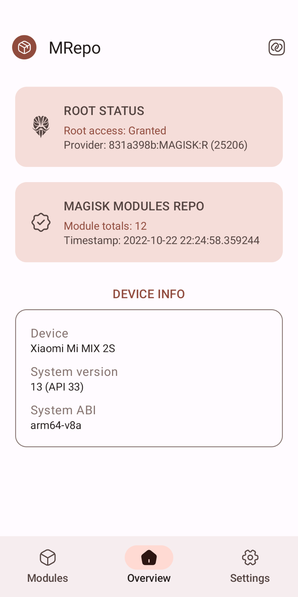
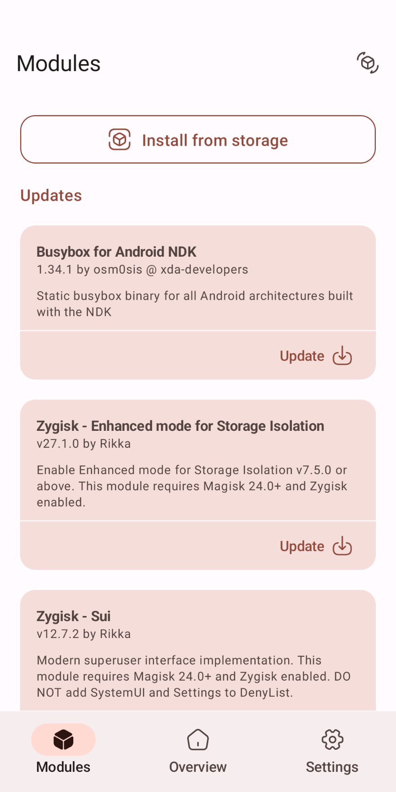
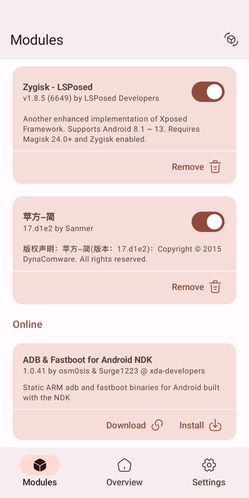
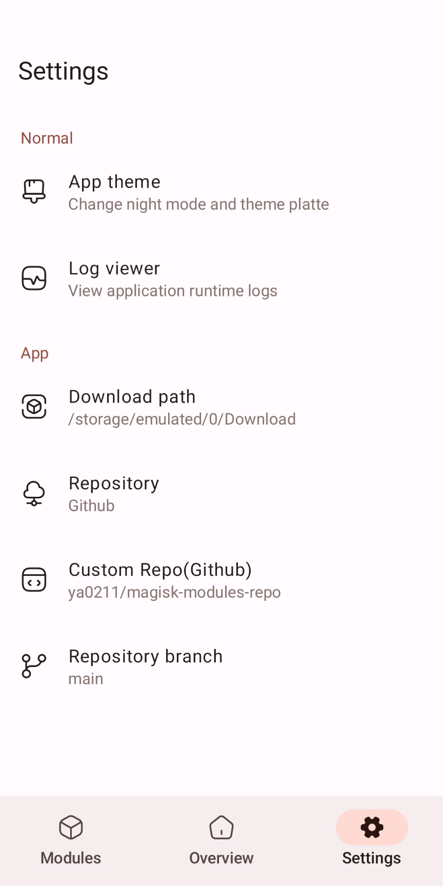
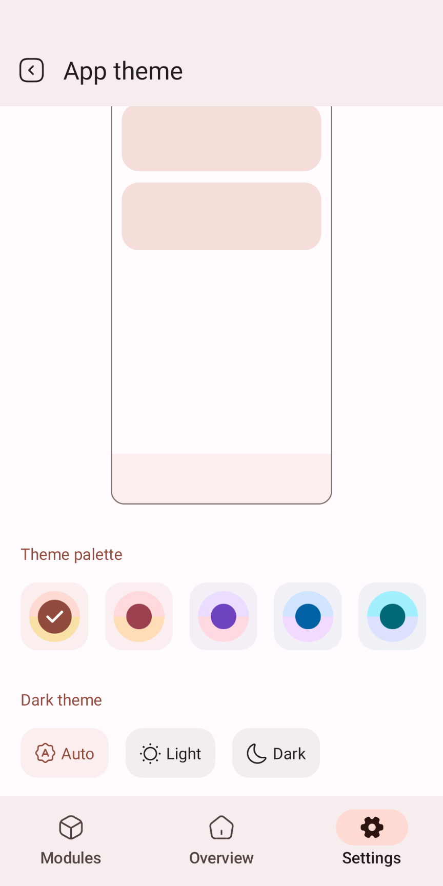
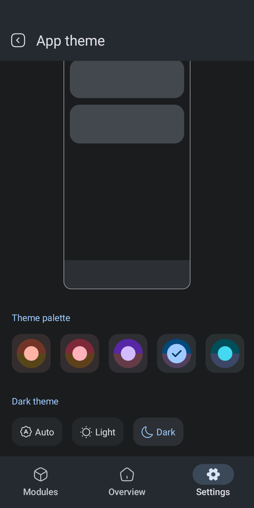

# MRepo
 
MRepo (short for `My Repository` or `Modules(Magisk) Repository`) is an Android app that helps manage your own module repository.

MRepo is written with [Jetpack Compose](https://developer.android.com/jetpack/compose).

## Preview

  
  

## What's this?
This is the first app I have completed since I learned Android development, and it still needs a lot of optimization. 

## Features
 - Jetpack Compose & Material Design 3
 - Download and update modules
 - your own module repository

## Supported Versions
Android 8.0 ~ 13

## Repo
It is recommended that you use own modules repository, the data structure of the JSON file can refer to [ya0211/magisk-modules-repo](https://github.com/ya0211/magisk-modules-repo).

## License

    Copyright (C) 2022 Sanmer

    This program is free software: you can redistribute it and/or modify
    it under the terms of the GNU General Public License as published by
    the Free Software Foundation, either version 3 of the License, or
    (at your option) any later version.

    This program is distributed in the hope that it will be useful,
    but WITHOUT ANY WARRANTY; without even the implied warranty of
    MERCHANTABILITY or FITNESS FOR A PARTICULAR PURPOSE.  See the
    GNU General Public License for more details.

    You should have received a copy of the GNU General Public License
    along with this program.  If not, see <https://www.gnu.org/licenses/>.